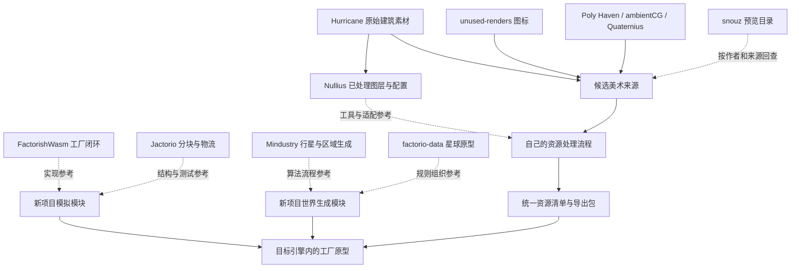

# 工厂游戏参考库：整合分析与 Codex 查询脉络

快照日期：2026-09-10。资源根目录：`D:/Project`。范围：已下载的 10 个 Git 仓库与 7 组素材。本文件是后续开发的参考导航与整合建议；没有把这些项目编译、移植或拼装成可运行游戏。

## 1. 给 Codex 的阅读方式

先读本文件第 2、3 节，按当前任务选择一条查询链，再到同目录 `SOURCE-MAP.md` 搜索入口编号，例如 `FW02`、`MI04`、`NU09`。该索引包含绝对路径、关键符号、当前行号；机器可读版本是 `reference-index.json`，另含提交号和入口文件哈希。

查询文件名时使用 `file-catalog.jsonl`。它是本地文件名索引，包含项目、相对/绝对路径、文件大小和 PNG 整图尺寸，不包含二进制正文。不要把整份索引塞入上下文；用关键词筛选后读取命中项即可。PNG 尺寸不是动画单帧尺寸，也不是建筑占地。

证据强度：本次阅读了关键生成链、目录说明、许可和若干实际图层定义，并查看了 Hurricane、unused-renders、Quaternius 的预览。其余入口做了路径核对；带定位字符串的入口还匹配了当前源文件。没有对每个函数、每张素材逐一审核，也没有验证跨平台构建、模拟性能或全部动画能否播放。

所有“建议”“拟定”“第一版”均为本次整合方案，不是上游已经实现的共同接口。原仓库 README 中的命令、版本要求和路径示例可能滞后；实施时以当前源码及文件定义核对。

## 2. 这套库如何分工

适合当前目标的主线是：**用 FactorishWasm 理解可运行的工厂闭环，用 Jactorio 深入地图和物流结构，用 Mindustry 学多星球生成，用 factorio-data 研究星球规则如何数据化；美术以 Hurricane + unused-renders 为主体，借 Nullius 的工具和配置组织成统一资源包。**

这是参考来源的组合，不意味着这些语言、引擎或许可证可以直接合并。用户尚未确定目标引擎与发行许可，因此本方案先保持引擎无关。

| 来源 | 在整套参考库中的角色 | 首先查询 | 使用边界 |
|---|---|---|---|
| FactorishWasm | 小型工厂游戏的全链路样本，Rust/Wasm + JS | FW01–FW13 | 容易顺着调用链读完；不是大型工厂的性能证明 |
| Jactorio | C++ 分块地图、原型配置、物流线段与测试 | JA01–JA18 | 代码与 `data/` 图片的许可不同 |
| Mindustry | 多星球、区域地图生成、后处理、成熟游戏系统对照 | MI01–MI17 | 区域战役体系与无限平面不同；依赖 Arc |
| factorio-data | Factorio 官方 Lua 原型、Space Age 星球与规则定义 | FD01–FD14 | 不是 Factorio 引擎源码，也不是官方图像资源包 |
| unused-renders | 物品、矿物、液体、科技图标主体 | UR01–UR06 | 主要是图标/物品渲染，不是完整建筑动画 |
| snouz 图形目录 | 大规模外观选型及原作者线索 | SN01–SN06 | 预览/拼图目录；部分动画、方向、阴影已去除；混合许可 |
| nullius-visual-overhaul | Hurricane 美术转成游戏图层的实用范例 | NU01–NU12 | 是 Nullius 的换皮 mod，不包含完整 Nullius 游戏 |
| Krastorio2Assets | 建筑、物流、资源、音效补充 | KR01–KR06 | 只有资源包；主 mod 行为与完整图层引用另在其他仓库 |
| OpenHV | 地形模板、序列、随机地图和逐资源许可元数据 | HV01–HV09 | OpenRA RTS 体系；像素风与 Hurricane 需要统一处理 |
| Material Maker | 自制岩石、锈蚀、金属纹理的离线生产工具 | MM01–MM06 | Godot 工具项目，不是可直接挂入游戏的世界生成器 |
| Hurricane | 工业建筑原始动画及分层素材主体 | HU01–HU05 | 不同建筑的 JSON/Lua/纯图片格式不同 |
| Quaternius Space Kit | 3D 星球道具、植被、载具、角色 | QU01–QU03 | 低多边形风格；需要重材质/重渲染才接近重工业风 |
| Poly Haven 样本 | 地面 PBR、岩石/蕨类模型 | PH01–PH06 | 仅所选 5 项样本，不含网站全部资源 |
| ambientCG 样本 | 地面、岩石、金属、波纹钢板 PBR | AC01–AC05 | 4 项 2K JPG 材质；岩石材质不是岩石模型 |
| Kenney UI | 面板、按钮、矢量 UI、字体入口 | KE01–KE04 | 是控件素材，不含生产队列/库存 UI 的游戏逻辑 |
| rubberduck VFX | 烟雾、火焰、爆炸及 Blender 源预设 | RD01–RD04 | 接入前需确认帧布局、透明度与混合方式 |
| BMacZero 音效 | 机械碰撞、按钮或设备动作样本 | BM01–BM03 | 9 个 WAV；不等于完整工业环境声与循环声库 |

### 真实来源关系与设计参考关系



实线中的 `Hurricane → Nullius` 有该项目 README 和 LICENSE 支持。其余指向“新项目”的连线是建议的数据流，不是当前已经存在的运行时依赖。

## 3. 按问题找文件

| 当前问题 | 推荐查询顺序 | 看完后应产出什么 |
|---|---|---|
| 同一个 seed 如何生成同一地图？ | FW01 → FW02 → FW04；再 JA01 → JA03 | 随机数来源、采样坐标、参数和生成版本清单 |
| 怎样按需扩展地图，避免分块接缝？ | FW05 → FW02 → FW03；JA04 → JA05 → JA17 | 世界/分块/局部坐标约定，边界重算策略 |
| 矿脉如何与地形分开？ | FW02 → JA01/JA02 → FD09 | 概率场、丰富度场、禁放区域的独立规则 |
| 如何做草地星、火山星、冰雪星？ | MI01 → MI02 → MI03/MI05 → FD02–FD07 | 一个 PlanetDefinition 与若干 biome 规则集 |
| 地图好看但开局无路、无矿怎么办？ | MI04 → MI06 → HV01/HV02；FD04 | 起始区保底、连通性修补与不可建造区处理 |
| 无限平面还是球面分区？ | FW05/JA05 对照 MI08/MI09/MI10 | 明确世界拓扑；避免用战役区生成器冒充无缝无限世界 |
| 传送带如何移动、堵塞、分流？ | FW08 → JA07 → JA08 → JA09 → JA16 | lane/segment 模型、连接变更和吞吐测试 |
| 机械臂与组装机如何配合？ | FW06 → FW07 → FW09/FW10；JA10/JA11 | 取货、放货、配方耗时和满仓停机的状态机 |
| 电网、管道、科技从哪里入手？ | FW11/FW12/FW14；MI15 | 最小接口与更新时机，不先引入整套上游引擎 |
| 存档应该保存哪些数据？ | FW13 → JA15 → MI16 | 原型 ID、世界 seed、生成版本、玩家改动和实体状态 |
| 怎么把建筑图正确摆在格子上？ | HU03/HU04 → NU09/NU10 → NU02/NU04 | 单帧矩形、锚点、方向、占地、图层顺序的导入规范 |
| 怎么给同一建筑做等级配色？ | NU06 → NU07 → NU05 → NU03 | base/mask/emission/shadow 分层和预览 |
| 找矿石、零件、流体和研究图标？ | UR02/UR04/UR05；SN02 回查来源 | 选定源图与用途，不直接导入整张 mipmap |
| 做多星球地面、岩石、植被？ | PH01–PH05 → AC01–AC04 → MM01/MM02；HV03 | 统一尺寸的地面纹理、过渡和装饰物集 |
| 素材能否进入可复用发布包？ | 先本文件第 7 节，再相应 LICENSE/SOURCE/文件元数据 | 文件级来源记录，明确哪些是参考、候选、已选用 |

## 4. 世界生成与工厂模拟的参考脉络

### 4.1 从最小分块生成开始：FactorishWasm → Jactorio

在 FactorishWasm 中，从 `D:/Project/FactorishWasm/src/lib.rs` 的 `gen_chunks_in_viewport` 进入 `src/terrain.rs` 的 `gen_chunk`。生成函数用世界 seed 建立各层噪声参数，以“分块坐标 × 分块尺寸 + 局部坐标”采样。先判断水域，水上不放矿；随后计算铁、铜、煤、石的值，选择最大正值，并用距离系数调整资源量。最后另调 `calculate_back_image` 处理地表连接图像。[FW01–FW05]

适合提炼的概念是：**逻辑地块生成与邻居相关的视觉生成分开**。同 seed、同参数、同版本的地形采样可以重算，但岸线图像还需要邻块信息。不要在“块未加载”时把未知邻居永久当成陆地或水；邻块到达后需使边界视觉缓存失效。这是基于该接口分工给新项目的建议，不是声称上游已经解决所有边界情况。

接着读 Jactorio：`src/game/world/world.cpp::GenerateChunk` 根据 `NoiseLayer` 顺序遍历配置层，为每层设置不同 seed 偏移、频率、octave 和 persistence，再将噪声范围映射到地块原型。`data/base/prototypes/worldGen.py` 是参数配置入口。地面层与资源层分开生成，资源跳过水域；丰富度由噪声区间与 richness 得出。[JA01–JA03]

这条链适合演进成自己的 `WorldGenerator → ChunkData → TileRenderer`。不要照搬层序号作为唯一随机分流标识：新增一层可能改变后续层的结果。若希望老存档稳定，建议为噪声层分配稳定 ID，并将生成器版本写入存档。

### 4.2 多星球：Mindustry 的球面区域 → 自己的星球定义

按下列实际路径阅读：

1. `D:/Project/Mindustry/core/src/mindustry/content/Planets.java`：行星挂接不同生成器和规则。[MI01]
2. `.../maps/generators/PlanetGenerator.java::generate(Tiles, Sector, WorldParams)`：由 `seedOffset + baseSeed` 设置生成器 seed；随机流还纳入 sector ID；区域坐标投影到球面，再调用 `genTile`，之后进行区域级生成。[MI02]
3. `.../maps/planet/SerpuloPlanetGenerator.java`：`rawHeight/getBlock` 负责噪声与地表选择；`generate` 再处理房间、道路、岸线、矿物、敌方基地等玩法结构。[MI03/MI04]
4. `.../maps/planet/ErekirPlanetGenerator.java`：比较 `rawTemp/getBlock/generate`，看另一组地形、液体、墙矿与资源规则如何形成差异。[MI05]
5. `.../maps/generators/BasicGenerator.java`：回查 `cells/distort/pathfind/inverseFloodFill` 等共用处理工具。[MI06]

关键判断：球面高度/颜色预览、地表 tile 生成、可玩的区域后处理是不同层次。只抄 `getHeight` 不能得到完整可玩地图。`Planets.java` 中 Erekir 的 `allowLaunchToNumbered = false`，且存在 `SectorPresets.java`，也说明“有行星生成器”不代表该星球所有战役关卡都以同一种随机流程产生。[MI01/MI10]

`Simplex`、`Ridged` 等来自 `arc.util.noise`。本地 Mindustry 的 `build.gradle` 将 Arc 作为依赖；当前 17 项中没有独立 Arc 源码仓库。若需要移植底层噪声实现，应另行追溯 Arc 的对应版本及许可，或选用目标项目自己的实现。[MI17]

### 4.3 Space Age：星球定义 → 生成参数 → 噪声表达式 → 实体

在 `D:/Project/factorio-data/space-age/prototypes/planet/` 按这条链查：

`planet.lua → planet-map-gen.lua → planet-<星球名>-map-gen.lua → ../tile/tiles-<星球名>.lua 与 ../entity/resources.lua`。[FD02–FD11]

- `planet.lua` 把星球属性与 `map_gen_settings` 连接起来；同时包含星际连接相关定义。
- `planet-map-gen.lua` 将 elevation、temperature、moisture、资源 probability/richness 等字段映射到具名表达式，并指定自动放置的实体、地砖、装饰物。
- 四个专用 map-gen 文件定义 Vulcanus、Gleba、Fulgora、Aquilo 的噪声表达式/函数。它们适合研究“同一套声明方式，怎样表达不同星球”。
- `core/lualib/resource-autoplace.lua` 与 `core/prototypes/noise-functions.lua` 是进一步追查通用构造方式的入口。[FD08/FD09]

这是数据与表达式定义。`data:extend`、`__base__` 路径及噪声表达式执行环境依赖 Factorio，复制 Lua 到普通解释器不能生成完整游戏地图；本仓库也不提供这些图片路径指向的完整官方 PNG。对独立游戏，优先借鉴字段划分和规则关系，自建自己的定义与求值器。[FD01]

### 4.4 物流与运行时：先闭环，再局部优化

先从 FactorishWasm 的 `simulate → Structure::frame_proc → assembler/inserter/transport_belt` 顺着一次更新追踪物品怎样消耗和产生。它便于识别生产闭环需要哪些职责。[FW06–FW10]

之后重点读 Jactorio 的 `ConveyorLane/ConveyorStruct → ConveyorLogicUpdate → conveyor_utility → conveyor_controllerTests`。当前更新器分阶段处理移动、跨段转移和分流；测试目录适合用来寻找堵塞、接入和拓扑变化的边界用例。[JA07–JA09/JA16]

Mindustry 的 Conveyor、GenericCrafter、PowerGraph 可作为独立对照，但不能假设其物流规则等同于 Factorio 双通道传送带。[MI13–MI15]

建议新项目让模拟不依赖图像帧和 GPU 对象：物品流用固定逻辑时钟，渲染根据状态插值；原型使用稳定 ID，存档保存 seed、生成版本及改动数据。此处是架构建议。参考项目之间没有经过验证的统一存档格式，也没有可直接互换的实体模型。

## 5. 美术资源如何组合成同一套风格

### 5.1 推荐的第一组素材来源

| 用途 | 首选 | 辅助来源与工作 |
|---|---|---|
| 化工、冶炼、生产设备 | Hurricane 的 chemical-stager、arc-furnace、manufacturer、fuel-refinery | Nullius 中已有处理后的图层与配置，可比较原始和加工结果 |
| 矿石、金属件、电子件、液体图标 | unused-renders 的 original 目录 | 按统一图标尺寸生成派生版本，保留同一物品多视角的用途区分 |
| 土地、沙地、林地、岩石表面 | Poly Haven + ambientCG 样本 | 用 Material Maker 或自己的处理流程做色调、尺寸、细节密度一致的地面集 |
| 岩石与植被物体 | Poly Haven 的 boulder_01、fern_02 | 用统一相机和灯光烘焙成精灵；更多物种仍需补充 |
| 输送带、分流器、储存箱等缺口 | 先查 Krastorio2Assets；snouz 用于外观检索 | 分别核对许可、完整动画和主 mod 定义；也可以自行制作 |
| 遥远星球、载具或环境道具 | Quaternius 的 Environment/Vehicles | 若采用 Hurricane 写实风，需要重材质与重新渲染 |
| 面板、按钮、槽位边框 | Kenney PNG/Vector | 统一色板与边框，不把库存逻辑寄托给图片包 |
| 排气、火花、爆炸 | rubberduck VFX | 先选一个特效验证透明边缘、帧顺序和播放节奏 |
| 建造、开关、机械动作 | BMacZero | 去掉不适合的片段并调整响度；循环机器声另行设计 |

视觉检查中，Hurricane 样本有较密的管线、锈蚀和实体阴影；unused-renders 的立体物品图适合作为相近方向的图标来源。Quaternius 的原始预览则是鲜艳、低多边形造型，直接并排使用会明显不一致。以上是样本观察，不代表检查了整个资源库每个文件。

### 5.2 最有价值的美术学习链：Hurricane → Nullius → 自己的导入器

读取 `D:/Project/Hurricane-Factorio-Buildings/factorio-sprites/` 中目标建筑，然后对照 `D:/Project/nullius-visual-overhaul/graphics/entity/` 的加工版本。接着读 `config/buildings.lua → lib/sprite.lua → lib/reskin.lua`，再查 `tools/README.md` 与 `tools/mask_ops.py`。[HU01–HU04/NU01–NU07]

可提炼成如下流程：原始图集 → 确认布局/切帧 → 选区与色罩 → 发光层拆分 → 重新打包 → 导出元数据 → 建筑原型绑定 → 场景预览。Nullius 的 `reskin.lua` 依赖 Factorio 原型 API，不能直接挂进别的游戏；其中参数规范化、遮罩处理、帧协调等思路更适合分别移植。

**已核对的具体差异：**

| 实际文件 | 当前定义 | 导入时的含义 |
|---|---|---|
| Nullius `chemical-stager-base.lua` [NU09] | width 394、height 397、sprite_count 60、line_length 8 | 60 个有效帧；不能将整张图的格子数直接当帧数 |
| Nullius `chemical-stager-shadow.lua` [NU10] | width 557、height 431、sprite_count 1；shift 与基底不同 | 阴影可为静态层；需要自己的尺寸和锚点 |
| Hurricane `fuel-refinery-animation.lua` [HU03] | 340×340、sprite_count 64、line_length 8 | Lua 定义使用 sprite_count |
| Hurricane `gravity-assembler-animation.json` [HU04] | 320×320、frame_count 100、line_length 10 | JSON 定义使用 frame_count，不能假设字段名统一 |

Nullius README 的 chemical-stager 示例提到另一组帧数；当前文件才是当前导入的依据。也不要将不同版本同名建筑的基底、阴影和发光层混配。

### 5.3 统一哪些参数，才能形成可复用套装

先选一栋建筑、一种矿石、一张地面和一个特效作为标定集，在目标引擎里做预览，然后确定：

- 世界格子尺寸、像素密度、相机角度与主光方向；图片宽高与逻辑占地分别记录。
- 物体锚点、相对地面位置、遮挡排序及各方向端口；不能由图片透明边界自动推断占地。
- base、shadow、mask、emission、icon 的命名、色彩空间、透明度及混合方式。
- 帧宽高、有效帧数、行列布局、帧率、循环范围和方向次序；阴影帧数可以不同。
- 地面材质的色调与纹理密度、地砖变体、岸线/生物群系过渡；PBR 贴图不会自动产生 tilemap 过渡集。
- 图集最大尺寸、透明边缘留白、采样方式和 mipmap 规则；缩小后的图标仍要可辨认。

不建议在尚未导入目标引擎时规定一组“Factorio 官方通用尺寸”。源图中的 scale/shift 往往使用特定引擎单位，必须转换成新项目的单位体系。

### 5.4 预览目录与重复来源

snouz README 明确说移除了动画、旋转、阴影等部分内容，应通过其 Mod list 回到原始 mod 获取完整资源。[SN01/SN02] `Ω LICENSES` 只是许可文本集合，不自动证明某张图片的许可归属。

同一件 Hurricane 美术可能同时出现在原始包、Nullius 加工包和 snouz 预览目录。把它们记录成“来源作品 → 具体版本 → 派生处理”，不要当成三个独立作者作品。优先保留高质量原始文件，使用加工包学习处理方式；不要用同名文件覆盖来做去重。

Quaternius 的 92 个模型保留了 blend/fbx/gltf/obj 等多个导出格式，模型数量不能按文件数相加。原始 `License.txt` 的标题写成另一个包名，本次额外核对了 [Ultimate Space Kit 作者页面](https://quaternius.com/packs/ultimatespacekit.html)，该页面明确列出本包为 92 个模型、CC0 及相应格式。保留这个来源差异记录。[QU03]

## 6. 建议的新项目模块与开发顺序

下面是待实现的结构，不是已经创建的 SDK。目标引擎确定后再映射成对应目录或包。

```text
factory-kit/
  definitions/       Item、Recipe、Building、Planet、Biome 的稳定 ID 与参数
  worldgen/          坐标、随机流、噪声、地形、矿物、开局修补、版本
  simulation/        库存、生产、物流、能源、液体、科技
  persistence/       存档版本、实体状态、地块改动、迁移
  rendering/         地面过渡、建筑分层、图集、动画、特效
  asset-pipeline/    素材校验、变换、打包、清单输出
  assets/source/     选定原始素材；保留来源结构
  assets/generated/ 可重建的引擎目标资源
  provenance/        作者、许可、来源版本、变换记录
  examples/          小型可运行工厂场景
```

### 最小数据契约

| 定义 | 建议字段 | 可参考的入口 |
|---|---|---|
| WorldSeed | world_seed、generator_version、稳定 layer ID | FW01/FW04/MI02 |
| PlanetDefinition | id、规则集、气候参数、可用资源、地面资源集、生成版本 | MI01/FD02/FD03 |
| ChunkData | planet_id、chunk_coord、地形 ID、资源储量、装饰种子、玩家改动 | FW01/JA06 |
| BuildingDefinition | id、占地、方向、端口、配方类别、耗能、visual_id | FW07/JA11/NU01 |
| RecipeDefinition | id、inputs、outputs、duration_ticks、环境限制 | FW10/FD12 |
| AssetDefinition | id、类型、source_path、图层、帧定义、锚点、import_profile、provenance_id | HU03/HU04/NU09/HV06 |
| Provenance | 上游 URL、版本/哈希、作者、许可证据位置、已做修改、来源作品 ID | SN02/NU11/HV07 |

建议使用 `reference_only`、`candidate`、`selected` 三种资源状态。来源不清楚时先保持 `reference_only`，不要将自动扫描出来的文件全部加入发布包。此状态表示项目内的选用进度，不是自动生成的法律结论。

### 四个可验收阶段

1. **单星球、最小生产闭环。** 一块可扩展地图，若干基础矿物，采矿 → 输送 → 冶炼/组装 → 入库，建筑可旋转拆除，状态可保存。读 FW、JA；先用简单显示验证模拟。验收：投入/产出守恒，堵塞时不丢失/复制物品，读档后继续生产。
2. **统一美术标定场景。** 导入一组 Hurricane 建筑、unused-renders 图标、一种地面与一种烟雾；使用自己的 AssetDefinition。读 HU、NU、UR、PH、RD。验收：占地与锚点吻合，帧播放正确，静态阴影正确跟随，缩放与透明边缘无明显错误。
3. **第二星球与规则差异。** 在同一生成框架下增加不同地形、资源和环境规则，验证 PlanetDefinition 真正能驱动差异。读 MI、FD。验收：固定 seed 重现、分块顺序不影响结果、起始资源可达、不同星球的存档状态互不覆盖。
4. **整理成可复用包。** 将生成器、模拟、资源导入与目标引擎适配分离；记录原型版本和来源；增加一个独立示例场景。验收：用一份配置能建立第二个场景，导出包只包含选定资源，能从已记录的源文件重建。

测试重点应是生成确定性、负坐标边界、块加载顺序、矿物保底与可达性、物流守恒、拓扑修改、存档往返和动画布局。不同 CPU/语言间的浮点噪声是否逐位一致需要额外验证，不能由“固定 seed”直接推出跨平台完全一致。性能目标需要在目标引擎中测量；本次没有做任何吞吐或帧率基准。

## 7. 选用前查询的许可证据

下表只归纳本地声明和明确的来源差异，便于 Codex 定位原文。它不把所有资源统一改为某种许可，也不以“公开可下载”推断“可随意复用”。

| 项目 | 已看到的声明/证据 | 文档中的处理方式 |
|---|---|---|
| FactorishWasm | 根 LICENSE 为 MIT [FW16] | 代码候选；本次未独立追溯所有图片来源 |
| Jactorio | 代码 MIT；`data/` 下非 `.py` 文件另受 Wube 许可约束，除非另有说明 [JA19] | 将代码参考与图片选用分别记录 |
| Mindustry | 根 LICENSE 为 GPLv3 [MI18] | 若复制或改编代码，保留该来源并按相应许可规划；不归入 MIT 代码包 |
| factorio-data | README 说明供原型定义追踪和 mod 作者使用 [FD01]；根目录未见通用宽松 LICENSE | 默认做规则参考；不声称它是独立游戏可随意搬用的代码/图像库 |
| unused-renders | CC BY 4.0 [UR06] | 保存 Malcolm Riley 署名、许可和改动记录 |
| snouz | README 的逐 mod 来源清单包含 MIT、CC BY、GPL/LGPL、NC/SA 等混合条目 [SN02] | 按单张素材回查；不能以仓库名字中的 free 作判断 |
| Nullius 换皮 | Lua/Python MIT；建筑图 CC BY 4.0；等级点图另标 Kirazy MIT [NU11] | 分组件记录作者与许可，不能仅看 mod 代码许可 |
| Krastorio2Assets | LGPLv3 [KR05] | 保留独立来源与许可记录，实施时核对所选内容及再分发安排 |
| OpenHV | 代码 GPL；内容多种 CC 许可，sprite 有逐文件 YAML 元数据 [HV06/HV07/HV09] | 优先读取选中图片旁的元数据和子目录说明 |
| Material Maker | MIT，README 保留“另有说明除外” [MM06] | 工具代码与输入素材分别记账；导出不抹去输入素材来源 |
| Hurricane 原始包 | SOURCE 标为 CC BY，未固定版本 [HU05]；Nullius 对其所收录建筑明确标 CC BY 4.0 [NU11] | 不将后者自动扩展到原包所有未来/其他内容；保留作者 Hurricane046 |
| Quaternius | 作者页面确认本包 CC0；本地 License 标题不一致，正文 CC0 [QU03] | 用作者页面与原文件共同记录来源差异 |
| Poly Haven 样本 | SOURCE 记录 CC0、许可链接及文件哈希 [PH06] | 按已选的具体资产 ID 建账 |
| ambientCG 样本 | SOURCE 记录 CC0、许可链接及下载哈希 [AC05] | 按具体材质 ID 建账 |
| Kenney UI | SOURCE 记录 CC0 [KE04]，同时保留原包文件 | 字体等实际选用项也检查其附带说明 |
| rubberduck VFX | SOURCE 记录作者、原页面和 CC0 [RD04] | 保留来源及派生图集生成记录 |
| BMacZero 音效 | SOURCE 记录作者、原页面和 CC0 [BM03] | 保留所选 WAV 来源及裁剪等改动记录 |

下载时生成的 `SOURCE.json` 是来源索引，不等于上游签发的许可证。项目实际发布时，应让选中的文件关联到上游许可原文、原包声明或作者页面。这里没有把 snouz README 对不同许可证的简写总结当成完整条款。

## 8. 当前资源库仍缺什么

- 没有统一游戏引擎、数据模型、导入器或资源包接口；这些是第 6 节拟定的后续实现。
- `factorio-data` 不含闭源引擎，Nullius 换皮包不含 Nullius 主 mod，Krastorio2Assets 不含 Krastorio 主 mod。不要把资源包的存在当成相应游戏逻辑已经下载完整。
- Arc、Blender、Spritter、目标引擎及各游戏构建工具的可执行环境没有在此次分析中安装/验证。下载源码不等于工具可立即运行。
- 现有地表材质不构成完整的多星球 tilemap：水岸、悬崖、过渡、矿床变体、植被密度与碰撞定义仍需制作。
- 传送带、机械臂等基础工业元素需要逐项确认完整视角/帧数及来源；Hurricane 的大型工厂建筑不能自动补齐这些小型物流部件。
- 音效、用户交互、角色、科技树、敌人、任务和平衡虽有参考来源，尚未被整合成一套一致设计。它们不是本次文档声称完成的功能。
- snouz 当前为浅克隆：工作区文件齐全，缺少完整历史。分析追踪到当前 HEAD；要跨历史比较需另行补历史。其他 Git 仓库的当前提交号见 `reference-index.json`。

## 9. 可直接复制给 Codex 的任务模板

```text
我正在开发一个具有 Factorio 工业美术方向、随机地形和多星球规则的工厂游戏。
参考库在 D:/Project，参考文档在 D:/Project/Factorio-Reference-Docs。

请先阅读 FACTORIO-REFERENCE-GUIDE.md，按本轮需求查询 SOURCE-MAP.md；
需要找文件时筛选 file-catalog.jsonl，不要整库读取图片或第三方依赖。

本轮目标：[写明一个可验收功能]
目标项目目录：[写明已有项目路径]
引擎/语言：[填写；如果已有项目则从配置确认]
成品与许可方向：[填写已有决定；尚未决定就保持未定]

先检查目标项目和已有实现，再选择最少的相关参考入口。
区分已验证的本地事实、自己的设计建议和仍需验证的假设。
涉及复用时区分算法理解、代码复制/改编、素材导入和运行时依赖。
不要修改原始参考库来实现游戏；在目标项目中实现本轮功能。
素材按文件记录来源、作者、许可证据、版本和处理步骤。
用当前源码/图层定义确认参数，不盲信 README 的旧示例。
完成后报告：做了什么、引用了哪些编号与路径、如何验证、尚缺什么。
```

任务例：做一张可扩展的单星球地图，就读 FW01–FW05、JA01–JA06、JA17/JA18；先不要同时引入战役、多人联机和全部星球。做建筑动画导入，就读 HU03/HU04、NU01–NU10；首先以 chemical-stager 的真实参数完成一个可预览样本。

## 10. 本机查询示例

以下命令只读取文件。PowerShell 在解析本地中文/特殊字符时明确使用 UTF-8。

```powershell
# 根据任务筛选已整理的入口。
$refDocsRoot = 'D:\Project\Factorio-Reference-Docs'
$refIndex = Get-Content -LiteralPath "$refDocsRoot\reference-index.json" -Raw -Encoding UTF8 | ConvertFrom-Json
$refIndex.references | Where-Object { ($_.tags -join ' ') -match 'planet|biome|ore' } |
    Select-Object id, project, path, line, purpose

# 从文件名索引找候选；这里只搜索目录和文件名，不读取图片正文。
rg -i 'chemical-stager|rusted_metal|boulder_01' "$refDocsRoot\file-catalog.jsonl"

# 精确查看有证据的定义。
rg -n 'sprite_count|frame_count|width|height|shift' 'D:\Project\nullius-visual-overhaul\graphics\entity\chemical-stager' -g '*.lua'

# 找多星球规则的挂接点，而不是一开始读取所有 Lua。
rg -n 'map_gen_settings|surface_properties' 'D:\Project\factorio-data\space-age\prototypes\planet\planet.lua'

# 查看参考版本是否改变。
git -C 'D:\Project\Mindustry' rev-parse HEAD
```

跨电脑使用时替换 `D:/Project` 根目录，保留 project + relative_path 作为稳定路径组合。更新仓库后应重新检查入口符号、帧参数和许可；本索引不是实时数据库。
